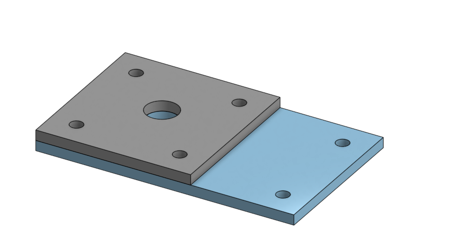
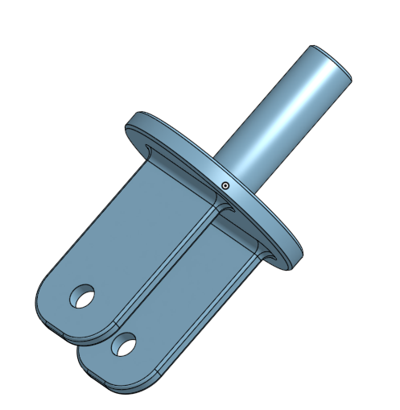

# BasicCAD

We are creating a caster.

---
## Table of Contents
* [Table of Contents](#Table-of-Contents)
* [Base](#Base)
* [Mount](#Mount)
* [Fork](#Fork)
* [Tire](#Tire)
* [Wheel](#Wheel)
* [AxleCollarBearings](#AxleCollarBearings)

## Base

### Description

The first assignment is to create the caster base.  The base's dimensions are 200 mm x 120 mm and 8 mm thick.  It has 6 holes 10 mm wide and 20 mm from the edge equally spaced along the edges.

### Evidence
[The Base in Onshape](https://cvilleschools.onshape.com/documents/e85344a5f4f8df9e5c0031be/w/f9bc14d39c9806c02c45b668/e/070360825e3781ef7a2730ce)

### Image

### Reflection

This was my first Onshape part and [following along with Dr. Shields made it super easy.](https://www.youtube.com/watch?v=93BFUD-HAG8&feature=emb_title&scrlybrkr=5670f0b4)  I learned about 
* sketching 
* constructions lines 
* dimensions 
* extruding both add and remove 
* linear patterns 

Onshape is awesome.  I found it really helpful to rename all my sketches.  It is going to be a GREAT year in engineering.

---

## Mount

### Description

The next thing we had to do was making the mount on top of the base. The dimensions of the mount was 120 mm x 120 mm and 8 mm thick. It needed 4 holes, I used the same ones as the base (10 mm wide and 20 mm from the edge). 

### Evidence

[The Mount in Onshape](https://cvilleschools.onshape.com/documents/e85344a5f4f8df9e5c0031be/w/f9bc14d39c9806c02c45b668/e/070360825e3781ef7a2730ce)

### Image

### Reflection

I learned how to 
* choose already existing things and build on top 
* extrude 

When I first started making the mount I was trying to do the whole thing seperatly. I was trying to put in all the dimensions for the holes again. I later got help from Mr. Helmstetter and he showed me how to build the mount right on top of the base. 

---

## Fork

### Description

For the fork we had to sketch a circle which was 80 mm and 8 mm thick. Then we had to create a rectangle which was 15 mm x 5 mm, and 75 mm thick. Then two circles one 15 mm the other 20 mm, and 60 mm thick. 

### Evidence

[The Fork in Onshape](https://cvilleschools.onshape.com/documents/e85344a5f4f8df9e5c0031be/w/f9bc14d39c9806c02c45b668/e/bf3cf79feb8d1de1e3f3cfff)

### Image

### Reflection

[I followed along with Dr. Shields made it super easy.](https://www.youtube.com/watch?v=wQlTfOw8rYQ&feature=emb_logo) I learned about 
* mirroring 
* using fillets 
* extruding 

This was super fun to make, it wasn't too hard for me.

---

## Tire

### Description

This assignment was to create the tire for the caster. We had to make a shape and then learn how to revolve it around a line. 

### Evidence

[The Tire in Onshape](https://cvilleschools.onshape.com/documents/e85344a5f4f8df9e5c0031be/w/f9bc14d39c9806c02c45b668/e/4e6ac61326d60e4eba3a5c7e)

### Image

### Reflection

[I followed along with Dr. Shields made it super easy.](https://www.youtube.com/watch?v=ReEGioIYSus&feature=emb_logo) I learned how to 
* sketch a trapezoid 
* use constuction lines 
* revole the sketch 
* use fillet 

---

## Wheel

### Description

### Evidence

### Image

### Reflection

---

## AxleCollarBearings

### Description

### Evidence

### Image

### Reflection

---
