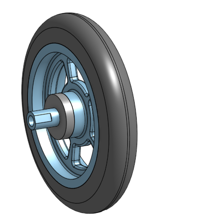

# BasicCAD

We are creating a caster.

---
## Table of Contents
* [Table of Contents](#Table-of-Contents)
* [Base](#Base)
* [Mount](#Mount)
* [Fork](#Fork)
* [Tire](#Tire)
* [Wheel](#Wheel)
* [AxleCollarBearings](#AxleCollarBearings)

## Base

### Description

The first assignment is to create the caster base.  The base's dimensions are 200 mm x 120 mm and 8 mm thick.  It has 6 holes 10 mm wide and 20 mm from the edge equally spaced along the edges.

### Evidence
[The Base in Onshape](https://cvilleschools.onshape.com/documents/e85344a5f4f8df9e5c0031be/w/f9bc14d39c9806c02c45b668/e/070360825e3781ef7a2730ce)

### Image

### Reflection

This was my first Onshape part and [following along with Dr. Shields made it super easy.](https://www.youtube.com/watch?v=93BFUD-HAG8&feature=emb_title&scrlybrkr=5670f0b4)  I learned about 
* sketching 
* constructions lines 
* dimensions 
* extruding both add and remove 
* linear patterns 

Onshape is awesome.  I found it really helpful to rename all my sketches.  It is going to be a GREAT year in engineering.

---

## Mount

### Description

The next thing we had to do was making the mount on top of the base. The dimensions of the mount was 120 mm x 120 mm and 8 mm thick. It needed 4 holes, I used the same ones as the base (10 mm wide and 20 mm from the edge). 

### Evidence

[The Mount in Onshape](https://cvilleschools.onshape.com/documents/e85344a5f4f8df9e5c0031be/w/f9bc14d39c9806c02c45b668/e/070360825e3781ef7a2730ce)

### Image

### Reflection

I tried doing it bymyself, but then I got some help. I learned how to 
* choose already existing things and build on top 
* extrude 

When I first started making the mount I was trying to do the whole thing seperatly. I was trying to put in all the dimensions for the holes again. I later got help from Mr. Helmstetter and he showed me how to build the mount right on top of the base. It was a lot of fun learning new ways to make things. 

---

## Fork

### Description

For the fork we had to sketch a circle which was 80 mm in diameter and 8 mm thick. Then we had to create a rectangle which was 15 mm x 5 mm, and 75 mm thick. Then two circles one 15 mm the other 20 mm, and 60 mm thick. 

### Evidence

[The Fork in Onshape](https://cvilleschools.onshape.com/documents/e85344a5f4f8df9e5c0031be/w/f9bc14d39c9806c02c45b668/e/bf3cf79feb8d1de1e3f3cfff)

### Image

### Reflection

[I followed along with Dr. Shields made it super easy.](https://www.youtube.com/watch?v=wQlTfOw8rYQ&feature=emb_logo) I learned about 
* mirroring 
* using fillets 
* extruding 
* sketching 

This was super fun to make, it wasn't too hard for me. I really enjoyed seeing how I could mirror a whole piece so I didn't have to make it again. 

---

## Tire

### Description

This assignment was to create the tire for the caster. We had to make a shape and then learn how to revolve it around a line. The trapezoid was 20 mm wide at the bottom and the sides were 10 mm from the vertical line. The top line is 55 mm from the horizontal line, and the bottom line is 40 mm from the horizontal line. 

### Evidence

[The Tire in Onshape](https://cvilleschools.onshape.com/documents/e85344a5f4f8df9e5c0031be/w/f9bc14d39c9806c02c45b668/e/4e6ac61326d60e4eba3a5c7e)

### Image

### Reflection

[I followed along with Dr. Shields made it super easy.](https://www.youtube.com/watch?v=ReEGioIYSus&feature=emb_logo) I learned how to 
* sketch a trapezoid 
* use construction lines 
* revole the sketch 
* use fillet 

I enjoyed using the revolve feature, but at first it was tricky for me to maek the trapezoid and get all the dimensions right. But after I got past that it was pretty easy. 

---

## Wheel

### Description

I had to make the wheel, to do that you we had to create three rectangles. One was 5 mm x 20 mm and 40 mm from the horizontal line, another was 20 mm in length and the top was 12.5 mm from the horizontal line and the bottom line was 5 mm. The last rectangle had a width of 5 mm. Then you will revolve it. 

### Evidence 

[The Wheel in Onshape](https://cvilleschools.onshape.com/documents/e85344a5f4f8df9e5c0031be/w/f9bc14d39c9806c02c45b668/e/cac9f3d75e2fc0be0abb8d80)

### Image

### Reflection

[I followed along with Dr. Shields made it super easy.](https://www.youtube.com/watch?v=RKeALFyqSGw&feature=emb_logo) I learned how to 
* sketch 
* revolve three different rectangles 
* extrude one region 
* fillet
* circular pattern

It was pretty easy as I followed along with the video. When I was skethcing the rectangles I kind of messed up, which took me a little bit to fix. But I enjoyed seeing it all come together in the end. 

---

## AxleCollarBearings

### Description

First we had to create the axle in order to do that we had to create two circles one with a diameter of 6 mm and the other with a diameter of 10 mm. Then we extruded that circle. Next we had to created the collar, for this I had to sketch a cirlce that was 15 mm in diameter and then extrude that. Finally I had to create the bearing which I put onto the wheel. 

### Evidence

[The Axle and Collar in Onshape](https://cvilleschools.onshape.com/documents/e85344a5f4f8df9e5c0031be/w/f9bc14d39c9806c02c45b668/e/fea014895edc63f74c1e9502)

[The Bearing in Onshape](https://cvilleschools.onshape.com/documents/e85344a5f4f8df9e5c0031be/w/f9bc14d39c9806c02c45b668/e/cac9f3d75e2fc0be0abb8d80)

### Image

### Reflection

[I followed along with Dr. Shields made it super easy.](https://www.youtube.com/watch?v=2r7YqGuF1vY&feature=emb_logo) While I Was doing this I learned how to 
* sketch 
* extrude 

This was really just using what I already knew to make it, so it wasn't hard. I enjoyed being able to do it very easily. 

---

## Sub Assembly 

### Description

This assignment was to put together the wheel and tire, and with it put in some bearings and a axle. 

### Evidence
[The Sub Assembly in Onshape](https://cvilleschools.onshape.com/documents/b15772945d26f7922561d782/w/852cbcb323f939c5c3bed21a/e/a6c00ccdc7e0c74b134184e8)

### Image

### Reflection

[following along with Dr. Shields made it super easy.](https://www.youtube.com/watch?v=R4PDBd8H5h8&feature=emb_logo)  I learned about 
* fastening 
* revole fastening 

I really enjoyed seeing it all come together. This part wasn't too hard for me, I did need to re watch some parts over again, but i eventually got it. 

